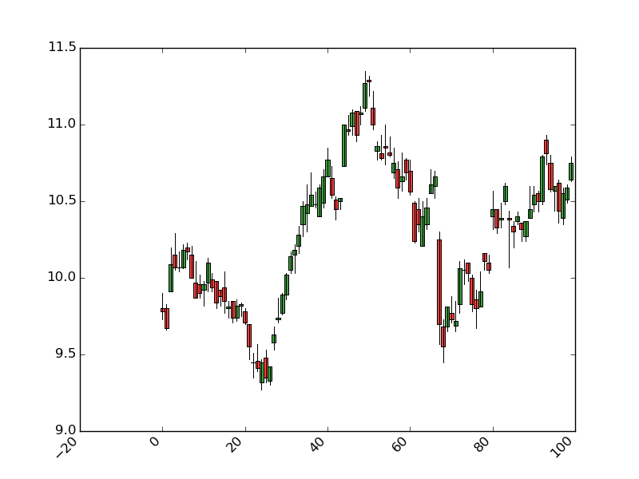
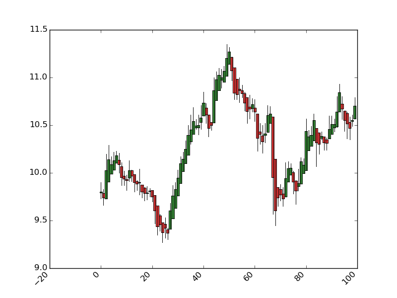

# finance-playground

# normal plot

# heikinashi

TODO:
- fill holes at begenning of the days [x]
- convert into other units of time [x]
- run heinkein ashi indicator on minutes [x]
- run heinkein ashi indicator on hour , 30 minutes, 10 minutes [x]
- add registry to register indicator and specify them by name
- add dictionnary to make correspond base tables to indicator tables
- manage conversion of table in main not in db_manager (move imports to main from db_manager)
- make generic candlebar plot (Or plot for each table (abstraction with inheritance)) [?]
- run performance tests for each indicator
- add index in SQL model on ticker columns